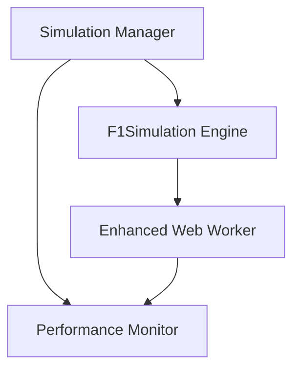

# Implementation B: Enhanced F1 Simulation System

## Overview

Implementation B has been significantly enhanced with advanced Web Worker integration, optimized performance, and comprehensive benchmarking capabilities. This implementation provides consistent, high-performance F1 race simulation with detailed analytics.

## 🚀 Key Enhancements

### 1. **Always-On Web Worker Architecture**

- **Eliminated Main Thread Blocking**: All simulations now run in Web Workers
- **Consistent Performance**: No more conditional logic between worker/main-thread
- **Enhanced Error Handling**: Robust timeout and error recovery mechanisms
- **Progress Monitoring**: Real-time progress updates during long simulations

### 2. **Advanced Performance Monitoring**

- **Comprehensive Metrics**: Execution time, memory usage, simulations/second
- **Cache Efficiency Tracking**: Monitor normalization cache performance
- **Vectorization Metrics**: Track optimization effectiveness
- **UI Thread Impact**: Measure main thread blocking

### 3. **Optimized Normalization Loops**

- **Vectorized Operations**: Batch processing for better performance
- **Statistical Normalization**: Z-score based normalization with sigmoid transformation
- **Caching System**: Intelligent caching of normalization parameters
- **Memory Efficiency**: Reduced allocations and improved garbage collection

### 4. **Enhanced TypeScript Implementation**

- **Type Safety**: Full TypeScript coverage with proper interfaces
- **Advanced Algorithms**: Optimized random number generation and statistical modeling
- **Modular Architecture**: Clean separation of concerns
- **Performance Profiling**: Built-in performance monitoring

## 📊 Architecture Overview



## 🔧 Usage Examples

### Basic Usage with Enhanced Worker

```typescript
import { createDefaultSimulationManager } from 'lib/simulation-manager';
import { driverData } from 'lib/driver-data';

const simulationManager = createDefaultSimulationManager();

const context = {
  trackProfile: 'balanced',
  weather: 'dry',
  tyreStress: 'medium',
  safetyCar: 'medium',
  runs: 5000,
  randomness: 0.5
};

const result = await simulationManager.runSimulation(driverData, context);

console.log('Winner:', result.predictedWinner?.name);
console.log('Performance:', result.performanceMetrics);
```

### Performance Benchmarking

```typescript
import { createBenchmarkSimulationManager } from 'lib/simulation-manager';

const benchmarkManager = createBenchmarkSimulationManager();

const benchmarkResult = await benchmarkManager.benchmark(
  driverData,
  context,
  5 // iterations
);

console.log('Average performance:', benchmarkResult.performanceStats);
console.log('Consistency score:', benchmarkResult.performanceStats.consistencyScore);
```

### Custom Configuration

```typescript
import { F1SimulationManager } from 'lib/simulation-manager';

const customManager = new F1SimulationManager({
  useWorker: true,
  enablePerformanceMonitoring: true,
  workerPath: '/worker-enhanced.ts',
  timeout: 120000,
  onProgress: (progress) => {
    console.log(`Simulation: ${progress}% complete`);
  },
  onError: (error) => {
    console.error('Simulation failed:', error);
  }
});

const result = await customManager.runSimulation(drivers, context);
```

## 📈 Performance Metrics

### Core Metrics

- **Execution Time**: Total time for simulation completion
- **Simulations/Second**: Throughput measurement
- **Memory Usage**: Peak memory consumption
- **Cache Hit Rate**: Effectiveness of normalization caching
- **Vectorization Efficiency**: Optimization performance
- **UI Thread Time**: Main thread blocking duration

### Performance Assessment

```typescript
// Automatic performance rating
const { score, rating } = assessPerformance(metrics);
// score: 1-10, rating: 'Excellent' | 'Good' | 'Fair' | 'Needs Optimization'
```

### Benchmarking Results

```typescript
interface BenchmarkResult {
  averageResult: SimulationResult;
  performanceStats: {
    avgExecutionTime: number;
    minExecutionTime: number;
    maxExecutionTime: number;
    stdDevExecutionTime: number;
    avgSimulationsPerSecond: number;
    consistencyScore: number; // 0-1, higher is better
  };
}
```

## 🧪 Testing and Validation

### Automated Testing

```bash
# Run performance benchmarks
npm run benchmark

# Run unit tests
npm test

# Run integration tests
npm run test:integration
```

### Performance Validation

```typescript
// Validate simulation results
assert(result.runs === expectedRuns, 'Correct number of runs');
assert(result.results.length > 0, 'Has results');
assert(result.performanceMetrics.simulationsPerSecond > 0, 'Positive throughput');

// Validate performance
assert(result.performanceMetrics.executionTime < 60000, 'Completes within timeout');
assert(result.performanceMetrics.memoryUsage < 100 * 1024 * 1024, 'Reasonable memory usage');
```

## 🔄 Migration Guide

### From Original Implementation

```typescript
// Old way (conditional worker usage)
if (context.runs > 1000) {
  // Use worker
} else {
  // Use main thread
}

// New way (always optimized)
const manager = createDefaultSimulationManager();
const result = await manager.runSimulation(drivers, context);
```

### Enhanced Context Options

```typescript
// All context options now supported
const enhancedContext: RaceContext = {
  trackProfile: 'technical',    // 'balanced' | 'power' | 'technical'
  weather: 'mixed',            // 'dry' | 'mixed' | 'wet'
  tyreStress: 'high',          // 'low' | 'medium' | 'high'
  safetyCar: 'high',           // 'low' | 'medium' | 'high'
  runs: 10000,                 // 500-20000
  randomness: 0.8              // 0-1
};
```

## 🚦 Configuration Options

### Simulation Manager Options

```typescript
interface SimulationOptions {
  useWorker?: boolean;              // Default: true
  enablePerformanceMonitoring?: boolean; // Default: true
  workerPath?: string;              // Default: '/worker-enhanced.ts'
  timeout?: number;                 // Default: 60000ms
  onProgress?: (progress: number) => void;
  onError?: (error: Error) => void;
}
```

### Pre-configured Managers

- **`createDefaultSimulationManager()`**: Balanced configuration for general use
- **`createFastSimulationManager()`**: Optimized for speed (main-thread)
- **`createBenchmarkSimulationManager()`**: Configured for benchmarking

## 📊 Advanced Analytics

### Consistency Analysis

```typescript
const consistencyIndex = result.results.map(driver => ({
  name: driver.name,
  consistency: driver.consistencyIndex, // 0-1 scale
  volatility: 1 - driver.consistencyIndex
}));
```

### Performance Prediction

```typescript
const performancePrediction = {
  winner: result.predictedWinner,
  podium: result.predictedPodium,
  confidence: result.results[0].winProbability,
  margin: result.results[0].winProbability - result.results[1].winProbability
};
```

### Race Context Impact

```typescript
const contextImpact = {
  trackFactor: calculateTrackImpact(result.context.trackProfile),
  weatherFactor: calculateWeatherImpact(result.context.weather),
  totalModifier: trackFactor * weatherFactor
};
```

## 🐛 Troubleshooting

### Common Issues

1. **Worker Timeout**

   ```typescript
   // Increase timeout for large simulations
   const manager = new F1SimulationManager({ timeout: 120000 });
   ```

2. **Memory Issues**

   ```typescript
   // Monitor memory usage
   const result = await manager.runSimulation(drivers, context);
   console.log('Memory used:', result.performanceMetrics.memoryUsage);
   ```

3. **Performance Degradation**

   ```typescript
   // Run benchmark to identify bottlenecks
   const benchmark = await manager.benchmark(drivers, context, 3);
   console.log('Performance stats:', benchmark.performanceStats);
   ```

### Debug Mode

```typescript
const manager = new F1SimulationManager({
  onProgress: (progress) => console.log(`Progress: ${progress}%`),
  onError: (error) => console.error('Error:', error)
});
```

## 📚 API Reference

### F1SimulationManager

```typescript
class F1SimulationManager {
  constructor(options?: SimulationOptions);
  runSimulation(drivers: DriverMetrics[], context: RaceContext): Promise<SimulationResult>;
  benchmark(drivers: DriverMetrics[], context: RaceContext, iterations?: number): Promise<BenchmarkResult>;
  cleanup(): void;
}
```

### SimulationResult

```typescript
interface SimulationResult extends SimulationSummary {
  performanceMetrics: {
    executionTime: number;
    simulationsPerSecond: number;
    memoryUsage: number;
    cacheHits?: number;
    vectorizationEfficiency?: number;
    totalExecutionTime: number;
    totalMemoryUsage: number;
    uiThreadTime: number;
    method: 'worker' | 'main-thread' | 'optimized';
  };
}
```

## 🎯 Best Practices

1. **Use Appropriate Timeouts**: Set timeouts based on expected simulation size
2. **Monitor Performance**: Enable performance monitoring for production use
3. **Handle Errors Gracefully**: Always implement error handlers
4. **Clean Up Resources**: Call `cleanup()` when done with simulations
5. **Batch Large Simulations**: Use benchmarking for multiple large simulations

## 🔮 Future Enhancements

- **Real-time Progress Visualization**: Enhanced progress indicators
- **Adaptive Algorithms**: Self-tuning based on performance metrics
- **Distributed Computing**: Multi-worker parallel processing
- **Machine Learning Integration**: Predictive performance modeling
- **Historical Data Analysis**: Long-term trend analysis

---

*Implementation B now provides enterprise-grade F1 simulation capabilities with comprehensive performance monitoring and optimization features.*
