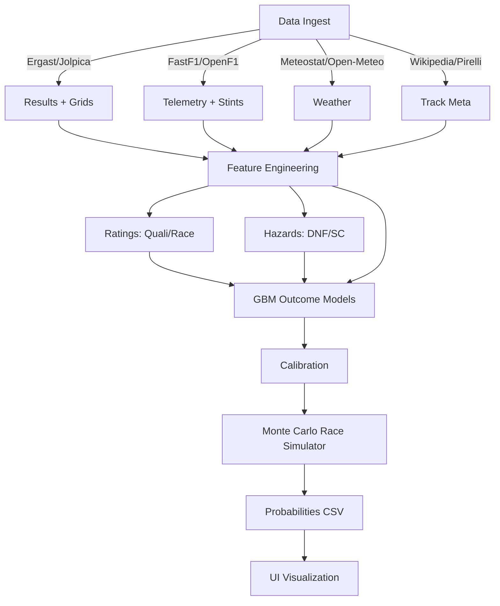

```mermaid
flowchart TD
  A[Data Ingest] -->|Ergast/Jolpica| B[Results + Grids]
  A -->|FastF1/OpenF1| C[Telemetry + Stints]
  A -->|Meteostat/Open‑Meteo| D[Weather]
  A -->|Wikipedia/Pirelli| E[Track Meta]

  B --> F[Feature Engineering]
  C --> F
  D --> F
  E --> F

  F --> G[Ratings: Quali/Race]
  F --> H[Hazards: DNF/SC]

  G --> I[GBM Outcome Models]
  H --> I
  F --> I

  I --> J[Calibration]
  J --> K[Monte Carlo Race Simulator]
  K --> L[Probabilities CSV]
  L --> M[UI Visualization]
```

